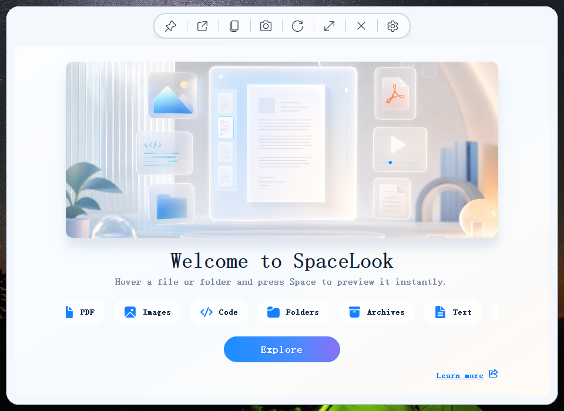
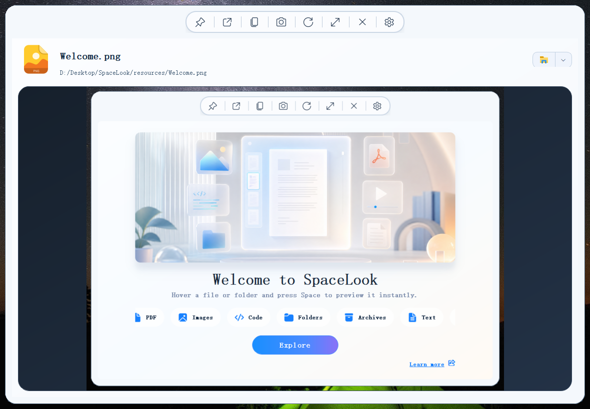
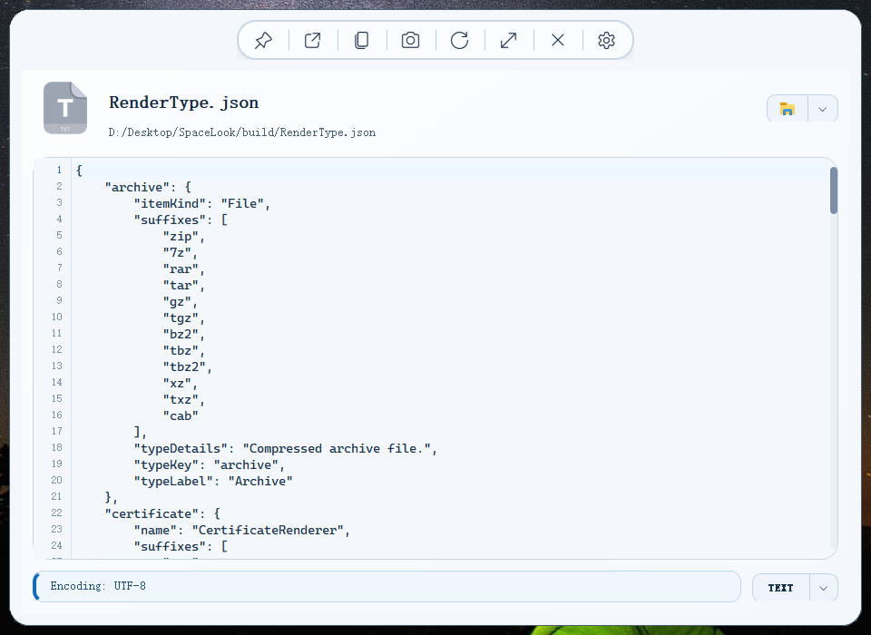
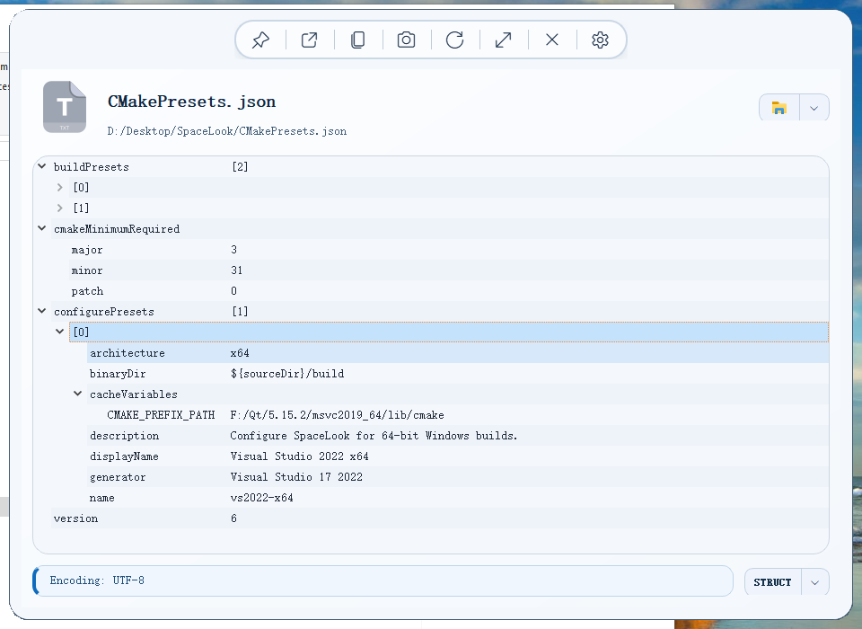
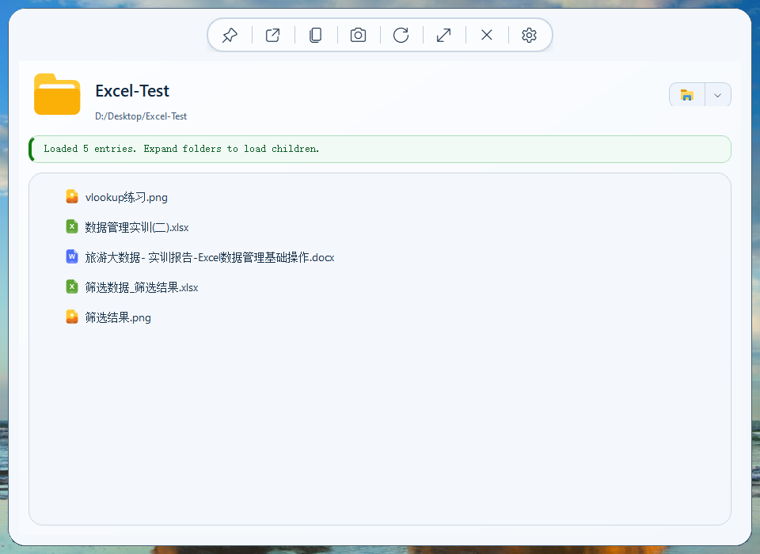
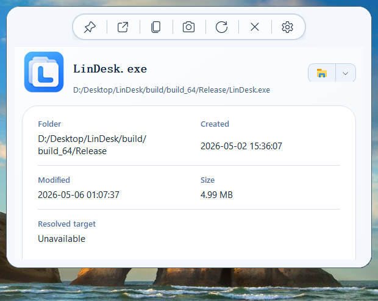

<p align="center">
    <picture>
      
  </picture>
</p>
<h3 align="center">
  <a href="README.md">English</a>
  <span> · </span>
  <a href="README.zh-CN.md">简体中文</a>
</h3>


# SpaceLook

SpaceLook is a fast Windows preview tool inspired by the simple idea that files should open just enough before you fully open them.

Hover a file, folder, shortcut, or desktop item. Press `Space`. SpaceLook opens a lightweight preview window near your workflow, then closes just as quickly when you are done.

## Highlights

1. Instant preview from the desktop and File Explorer.
2. Clean floating preview window with a compact capsule menu.
3. Image preview with zoom, pan, copy, and animated image support.
4. PDF preview with page thumbnails, lazy loading, page input, and smooth navigation.
5. Code preview with syntax highlighting and line numbers.
6. JSON, XML, YAML, and YML structure view with collapsible nodes.
7. Markdown and HTML rendered preview.
8. Folder preview with filtering, nested preview stack, and default app actions.
9. Audio and video preview that starts paused, so playback stays under user control.
10. Summary fallback for shortcuts, executables, shell items, and unknown files.

## How to Use
1. Hover over a file, folder, shortcut, or shell item on the desktop or in File Explorer.
2. Press `Space` to open the preview window.
3. Press `Space` again to close the current preview.
4. Press `Esc` to close the preview immediately.
5. Use the capsule menu for pin, open, copy path, refresh, expand, and close actions.

## Practical Features

1. Preview nested folder contents and open inner items from the folder preview.
2. Search inside text, code, PDF, and structured data previews.
3. Switch JSON, XML, YAML, and YML between text and structure views.
4. Use the settings page to control menu placement, visibility, startup behavior, tray behavior, and file type mappings.
5. Use the OCR entry point when you need to capture text from an image area.

## Preview Type Coverage Matrix

`✅` marks formats currently routed by `core/RenderType.json` and active renderer `canHandle()` checks. Entries without `✅` are target coverage.

| Category | Renderer | Supported formats or target behavior |
| --- | --- | --- |
| 📕 PDF and Page Documents | `PdfRenderer` | ✅ `pdf`, ✅ `xps`, ✅ `oxps` |
| 📝 Office Documents | `DocumentRenderer` | ✅ `doc`, ✅ `docx`, `docm`, `dot`, `dotx`, ✅ `rtf`, ✅ `xls`, ✅ `xlsx`, `xlsm`, `xlsb`, `xlt`, `xltx`, ✅ `ppt`, ✅ `pptx`, `pptm`, `pps`, `ppsx`, `vsd`, `vsdx` |
| 📝 OpenDocument Files | `DocumentRenderer` | `odt`, `ott`, `ods`, `ots`, `odp`, `otp`, `odg`, `otg`, `odf` |
| 🌐 Markup Documents | `RenderedPageRenderer` | ✅ `md`, ✅ `markdown`, ✅ `mdown`, ✅ `mkd`, ✅ `html`, ✅ `htm`, ✅ `xhtml`, ✅ `mhtml` |
| 📄 Code Files, C Family | `CodeRenderer` | ✅ `c`, ✅ `cc`, ✅ `cpp`, ✅ `cxx`, ✅ `h`, ✅ `hpp`, ✅ `hh`, ✅ `hxx`, ✅ `m`, ✅ `mm`, ✅ `cs`, ✅ `java`, ✅ `kt`, ✅ `kts`, ✅ `swift` |
| 📄 Code Files, Web and UI | `CodeRenderer` | ✅ `js`, ✅ `mjs`, ✅ `cjs`, ✅ `jsx`, ✅ `ts`, ✅ `tsx`, ✅ `qml`, ✅ `vue`, ✅ `svelte`, ✅ `astro`, ✅ `css`, ✅ `scss`, ✅ `sass`, ✅ `less` |
| 📄 Code Files, Scripting | `CodeRenderer` | ✅ `py`, ✅ `pyw`, ✅ `ipynb`, ✅ `rb`, ✅ `php`, ✅ `sh`, ✅ `bash`, ✅ `zsh`, ✅ `fish`, ✅ `ps1`, ✅ `psm1`, ✅ `psd1`, ✅ `bat`, ✅ `cmd`, ✅ `lua`, ✅ `dart`, ✅ `pl`, ✅ `pm`, ✅ `t` |
| 📄 Code Files, Data and Query | `CodeRenderer` | ✅ `sql`, ✅ `r`, ✅ `rmd`, ✅ `jl`, ✅ `do`, ✅ `ado`, ✅ `sas` |
| 📄 Code Files, JVM and BEAM | `CodeRenderer` | ✅ `scala`, ✅ `sc`, ✅ `groovy`, ✅ `gradle`, ✅ `ex`, ✅ `exs`, ✅ `erl`, ✅ `hrl`, ✅ `clj`, ✅ `cljs`, ✅ `cljc` |
| 📄 Code Files, Systems and Shaders | `CodeRenderer` | ✅ `go`, ✅ `rs`, ✅ `zig`, ✅ `nim`, ✅ `v`, ✅ `asm`, ✅ `s`, ✅ `glsl`, ✅ `vert`, ✅ `frag`, ✅ `hlsl`, ✅ `fx`, ✅ `wgsl`, ✅ `metal` |
| 📄 Code Files, Build and Project | `CodeRenderer` | ✅ `dockerfile`, ✅ `containerfile`, ✅ `makefile`, ✅ `mk`, ✅ `ninja`, ✅ `bazel`, ✅ `bzl`, ✅ `BUILD`, ✅ `sln`, ✅ `vcxproj`, ✅ `csproj`, ✅ `fsproj` |
| 📄 Text and Structured Data | `TextRenderer` | ✅ `txt`, ✅ `log`, ✅ `json`, ✅ `jsonc`, ✅ `xml`, ✅ `yaml`, ✅ `yml`, ✅ `toml`, ✅ `ini`, ✅ `conf`, ✅ `config`, ✅ `cfg`, ✅ `env`, ✅ `csv`, ✅ `tsv`, ✅ `properties`, ✅ `editorconfig`, ✅ `gitignore`, ✅ `gitattributes`, ✅ `reg`, ✅ `props`, ✅ `targets`, ✅ `cmake`, ✅ `qrc`, ✅ `qss`, ✅ `ui`, ✅ `pri`, ✅ `pro`, ✅ `tsbuildinfo` |
| 🎨 Images, Raster and Vector | `ImageRenderer` | ✅ `png`, ✅ `jpg`, ✅ `jpeg`, ✅ `jpe`, ✅ `bmp`, ✅ `dib`, ✅ `gif`, ✅ `webp`, ✅ `heic`, ✅ `heif`, ✅ `avif`, ✅ `tif`, ✅ `tiff`, ✅ `svg`, ✅ `ico`, ✅ `dds`, ✅ `tga` |
| 🎬 Camera RAW Images | `ImageRenderer` | `raw`, `dng`, `cr2`, `cr3`, `nef`, `arw`, `orf`, `rw2`, `raf`, `pef`, `srw`  |
| 🎬 Audio | `MediaRenderer` | ✅ `mp3`, ✅ `wav`, ✅ `flac`, ✅ `aac`, ✅ `m4a`, ✅ `wma`, ✅ `aiff`, ✅ `aif`, ✅ `alac`, ✅ `ape`, ✅ `mid`, ✅ `midi`, ✅ MPV required `ogg`, ✅ MPV required `oga`, ✅ MPV required `opus` |
| 🎬 Video | `MediaRenderer` | ✅ `mp4`, ✅ `mkv`, ✅ `avi`, ✅ `mov`, ✅ `wmv`, ✅ `webm`, ✅ `m4v`, ✅ `mpg`, ✅ `mpeg`, ✅ `mts`, ✅ `m2ts`, `3gp`, `flv`, `ogv`, `ts` |
| Subtitles and Captions | `TextRenderer` | `srt`, `vtt`, `ass`, `ssa`, `sub`, `idx` |
| Archives and Packages | `ArchiveRenderer` | ✅ `zip`, ✅ `7z`, ✅ `rar`, ✅ `tar`, ✅ `gz`, ✅ `tgz`, ✅ `bz2`, ✅ `tbz`, ✅ `tbz2`, ✅ `xz`, ✅ `txz`, ✅ `cab`, `iso`, `jar`, `war`, `ear`, `apk`, `ipa`, `nupkg`, `vsix`, `crx`, `appx`, `msix` |
| Design Files | `SummaryRenderer` | ✅ `psd`, `ai`, `eps`, `sketch`, `fig`, `xd`, `indd`, `idml`, `cdr`, `afdesign`, `afphoto`, `aseprite`  |
| CAD and Engineering | `SummaryRenderer` | `dwg`, `dxf`, `step`, `stp`, `iges`, `igs`, `stl`, `sat`, `sldprt`, `sldasm`, `ipt`, `iam`, `f3d`, `fcstd`  |
| 3D Models | `SummaryRenderer` | `obj`, `fbx`, `glb`, `gltf`, `dae`, `3ds`, `ply`, `usd`, `usdz`, `blend`, `abc`, `ifc`  |
| GIS Files | `SummaryRenderer` | `shp`, `shx`, `dbf`, `prj`, `geojson`, `kml`, `kmz`, `tif`, `tiff`, `geotiff`, `gpkg`, `gdb`, `mbtiles`, `osm`, `pbf`  |
| eBook and Comic Files | `SummaryRenderer` | `epub`, `mobi`, `azw`, `azw3`, `azw4`, `fb2`, `djvu`, `djv`, `cbz`, `cbr`, `cb7`, `cbt`  |
| Medical Imaging | `SummaryRenderer` | `dcm`, `dicom`, `nii`, `nii.gz`, `nrrd`, `mha`, `mhd`, `img`, `hdr`  |
| Scientific and Analytics Data | `SummaryRenderer` | `h5`, `hdf5`, `nc`, `netcdf`, `mat`, `parquet`, `feather`, `arrow`, `fits`, `fit`, `sav`, `dta`, `por`  |
| Finance, Calendar, and Contacts | `SummaryRenderer` | `ofx`, `qif`, `qfx`, `xbrl`, `ixbrl`, `ics`, `ical`, `vcf`, `vcard`  |
| Database Files | `SummaryRenderer` | `sqlite`, `sqlite3`, `db`, `db3`, `mdb`, `accdb`, `frm`, `ibd`, `bak`, `dump`, `sqlitedb`  |
| Fonts | `SummaryRenderer` | `ttf`, `otf`, `woff`, `woff2`, `eot`, `ttc`, `fon`  |
| Certificates and Keys | `CertificateRenderer` | ✅ `cer`, ✅ `crt`, ✅ `pem`, ✅ `der`, ✅ `pfx`, ✅ `p12`, ✅ `key`, ✅ `pub`, ✅ `asc`, ✅ `gpg`  |
| Executables and Installers | `SummaryRenderer` | ✅ `exe`, ✅ `dll`, ✅ `msi`, `msix`, `appx`, ✅ `com`, ✅ `scr`, ✅ `sys` |
| Shortcuts and Shell Items | `SummaryRenderer` | ✅ `lnk`, ✅ `url`, ✅ `appref-ms` |
| Folders and Generic Files | `FolderRenderer`, `SummaryRenderer` | ✅ File system folders, ✅ shell folders, ✅ desktop items, ✅ unknown file types, ✅ generic fallback preview |

## Screenshots

<p>
  
</p>

<p>
  
</p>

<p>
  
</p>

<p>
  
</p>

<p>
  
</p>

## Requirements

1. Windows 10 or later.
2. Qt 5.12.2 based desktop runtime.
3. Optional Microsoft Office installation for better legacy Office preview behavior.
4. Optional MPV runtime for enhanced audio format support.

## Build

```powershell
cmake --build build --config Debug --target SpaceLook
```

## Support
if SpaceLook helps you, you can support the project with the WeChat appreciation code below.
#### Thanks♪(･ω･)ﾉ 
<p>
  
</p>
WeChat QR Code