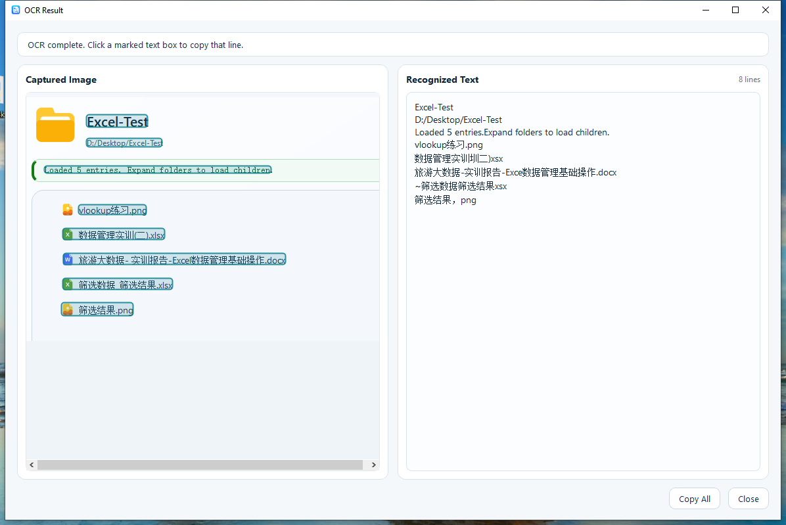

<p align="center">
    <picture>
      
  </picture>
</p>
<h3 align="center">
  <a href="README.md">English</a>
  <span> · </span>
  <a href="README.zh-CN.md">简体中文</a>
</h3>

# SpaceLook

SpaceLook 是一个快速的 Windows 预览工具，灵感来自于这样一个简单想法：文件应该在你完全打开它们之前就足够打开。

悬停文件、文件夹、快捷方式或桌面项目。按 `Space`。SpaceLook 在你的工作流程附近打开一个轻量级的预览窗口，然后在你完成后快速关闭。

## 亮点

1. 从桌面和文件资源管理器即时预览。
2. 带有紧凑胶囊菜单的干净浮动预览窗口。
3. 图像预览，支持缩放、平移、复制和动画图像。
4. PDF 预览，支持页面缩略图、延迟加载、页面输入和流畅导航。
5. 代码预览，支持语法高亮和行号。
6. JSON、XML、YAML 和 YML 结构视图，支持可折叠节点。
7. Markdown 和 HTML 渲染预览。
8. 文件夹预览，支持过滤、嵌套预览堆栈和默认应用操作。
9. 音频和视频预览，从暂停开始播放，因此播放控制在用户手中。
10. 快捷方式、可执行文件、shell 项目和未知文件的摘要回退。

## 如何使用
1. 在桌面或文件资源管理器中悬停文件、文件夹、快捷方式或 shell 项目。
2. 按 `Space` 打开预览窗口。
3. 再次按 `Space` 关闭当前预览。
4. 按 `Esc` 立即关闭预览。
5. 使用胶囊菜单进行固定、打开、复制路径、刷新、展开和关闭操作。

## 实用功能

1. 预览嵌套文件夹内容，并从文件夹预览中打开内部项目。
2. 在文本、代码、PDF 和结构化数据预览中搜索。
3. 在文本和结构视图之间切换 JSON、XML、YAML 和 YML。
4. 使用设置页面控制菜单位置、可见性、启动行为、托盘行为和文件类型映射。
5. 当您需要从图像区域捕获文本时，使用 OCR 入口点。

## 预览类型覆盖矩阵

`✅` 标记由 `core/RenderType.json` 路由并由活动渲染器 `canHandle()` 检查的格式。没有 `✅` 的条目是目标覆盖。

| 类别 | 渲染器 | 支持的格式或目标行为 |
| --- | --- | --- |
| PDF 和页面文档 | `PdfRenderer` | ✅ `pdf`, ✅ `xps`, ✅ `oxps` |
| Office 文档 | `DocumentRenderer` | ✅ `doc`, ✅ `docx`, `docm`, `dot`, `dotx`, ✅ `rtf`, ✅ `xls`, ✅ `xlsx`, `xlsm`, `xlsb`, `xlt`, `xltx`, ✅ `ppt`, ✅ `pptx`, `pptm`, `pps`, `ppsx`, `vsd`, `vsdx` |
| OpenDocument 文件 | `DocumentRenderer` | `odt`, `ott`, `ods`, `ots`, `odp`, `otp`, `odg`, `otg`, `odf` |
| 标记文档 | `RenderedPageRenderer` | ✅ `md`, ✅ `markdown`, ✅ `mdown`, ✅ `mkd`, ✅ `html`, ✅ `htm`, ✅ `xhtml`, ✅ `mhtml` |
| 代码文件，C 系列 | `CodeRenderer` | ✅ `c`, ✅ `cc`, ✅ `cpp`, ✅ `cxx`, ✅ `h`, ✅ `hpp`, ✅ `hh`, ✅ `hxx`, ✅ `m`, ✅ `mm`, ✅ `cs`, ✅ `java`, ✅ `kt`, ✅ `kts`, ✅ `swift` |
| 代码文件，Web 和 UI | `CodeRenderer` | ✅ `js`, ✅ `mjs`, ✅ `cjs`, ✅ `jsx`, ✅ `ts`, ✅ `tsx`, ✅ `qml`, ✅ `vue`, ✅ `svelte`, ✅ `astro`, ✅ `css`, ✅ `scss`, ✅ `sass`, ✅ `less` |
| 代码文件，脚本 | `CodeRenderer` | ✅ `py`, ✅ `pyw`, ✅ `ipynb`, ✅ `rb`, ✅ `php`, ✅ `sh`, ✅ `bash`, ✅ `zsh`, ✅ `fish`, ✅ `ps1`, ✅ `psm1`, ✅ `psd1`, ✅ `bat`, ✅ `cmd`, ✅ `lua`, ✅ `dart`, ✅ `pl`, ✅ `pm`, ✅ `t` |
| 代码文件，数据和查询 | `CodeRenderer` | ✅ `sql`, ✅ `r`, ✅ `rmd`, ✅ `jl`, ✅ `do`, ✅ `ado`, ✅ `sas` |
| 代码文件，JVM 和 BEAM | `CodeRenderer` | ✅ `scala`, ✅ `sc`, ✅ `groovy`, ✅ `gradle`, ✅ `ex`, ✅ `exs`, ✅ `erl`, ✅ `hrl`, ✅ `clj`, ✅ `cljs`, ✅ `cljc` |
| 代码文件，系统和着色器 | `CodeRenderer` | ✅ `go`, ✅ `rs`, ✅ `zig`, ✅ `nim`, ✅ `v`, ✅ `asm`, ✅ `s`, ✅ `glsl`, ✅ `vert`, ✅ `frag`, ✅ `hlsl`, ✅ `fx`, ✅ `wgsl`, ✅ `metal` |
| 代码文件，构建和项目 | `CodeRenderer` | ✅ `dockerfile`, ✅ `containerfile`, ✅ `makefile`, ✅ `mk`, ✅ `ninja`, ✅ `bazel`, ✅ `bzl`, ✅ `BUILD`, ✅ `sln`, ✅ `vcxproj`, ✅ `csproj`, ✅ `fsproj` |
| 文本和结构化数据 | `TextRenderer` | ✅ `txt`, ✅ `log`, ✅ `json`, ✅ `jsonc`, ✅ `xml`, ✅ `yaml`, ✅ `yml`, ✅ `toml`, ✅ `ini`, ✅ `conf`, ✅ `config`, ✅ `cfg`, ✅ `env`, ✅ `csv`, ✅ `tsv`, ✅ `properties`, ✅ `editorconfig`, ✅ `gitignore`, ✅ `gitattributes`, ✅ `reg`, ✅ `props`, ✅ `targets`, ✅ `cmake`, ✅ `qrc`, ✅ `qss`, ✅ `ui`, ✅ `pri`, ✅ `pro`, ✅ `tsbuildinfo` |
| 图像，光栅和矢量 | `ImageRenderer` | ✅ `png`, ✅ `jpg`, ✅ `jpeg`, ✅ `jpe`, ✅ `bmp`, ✅ `dib`, ✅ `gif`, ✅ `webp`, ✅ `heic`, ✅ `heif`, ✅ `avif`, ✅ `tif`, ✅ `tiff`, ✅ `svg`, ✅ `ico`, ✅ `dds`, ✅ `tga` |
| 相机 RAW 图像 | `ImageRenderer` | `raw`, `dng`, `cr2`, `cr3`, `nef`, `arw`, `orf`, `rw2`, `raf`, `pef`, `srw`  |
| 音频 | `MediaRenderer` | ✅ `mp3`, ✅ `wav`, ✅ `flac`, ✅ `aac`, ✅ `m4a`, ✅ `wma`, ✅ `aiff`, ✅ `aif`, ✅ `alac`, ✅ `ape`, ✅ `mid`, ✅ `midi`, ✅ 需要 MPV `ogg`, ✅ 需要 MPV `oga`, ✅ 需要 MPV `opus` |
| 视频 | `MediaRenderer` | ✅ `mp4`, ✅ `mkv`, ✅ `avi`, ✅ `mov`, ✅ `wmv`, ✅ `webm`, ✅ `m4v`, ✅ `mpg`, ✅ `mpeg`, ✅ `mts`, ✅ `m2ts`, `3gp`, `flv`, `ogv`, `ts` |
| 字幕和字幕 | `TextRenderer` | `srt`, `vtt`, `ass`, `ssa`, `sub`, `idx` |
| 档案和包 | `ArchiveRenderer` | ✅ `zip`, ✅ `7z`, ✅ `rar`, ✅ `tar`, ✅ `gz`, ✅ `tgz`, ✅ `bz2`, ✅ `tbz`, ✅ `tbz2`, ✅ `xz`, ✅ `txz`, ✅ `cab`, `iso`, `jar`, `war`, `ear`, `apk`, `ipa`, `nupkg`, `vsix`, `crx`, `appx`, `msix` |
| 设计文件 | `SummaryRenderer` | ✅ `psd`, `ai`, `eps`, `sketch`, `fig`, `xd`, `indd`, `idml`, `cdr`, `afdesign`, `afphoto`, `aseprite`  |
| CAD 和工程 | `SummaryRenderer` | `dwg`, `dxf`, `step`, `stp`, `iges`, `igs`, `stl`, `sat`, `sldprt`, `sldasm`, `ipt`, `iam`, `f3d`, `fcstd`  |
| 3D 模型 | `SummaryRenderer` | `obj`, `fbx`, `glb`, `gltf`, `dae`, `3ds`, `ply`, `usd`, `usdz`, `blend`, `abc`, `ifc`  |
| GIS 文件 | `SummaryRenderer` | `shp`, `shx`, `dbf`, `prj`, `geojson`, `kml`, `kmz`, `tif`, `tiff`, `geotiff`, `gpkg`, `gdb`, `mbtiles`, `osm`, `pbf`  |
| 电子书和漫画文件 | `SummaryRenderer` | `epub`, `mobi`, `azw`, `azw3`, `azw4`, `fb2`, `djvu`, `djv`, `cbz`, `cbr`, `cb7`, `cbt`  |
| 医学成像 | `SummaryRenderer` | `dcm`, `dicom`, `nii`, `nii.gz`, `nrrd`, `mha`, `mhd`, `img`, `hdr`  |
| 科学和分析数据 | `SummaryRenderer` | `h5`, `hdf5`, `nc`, `netcdf`, `mat`, `parquet`, `feather`, `arrow`, `fits`, `fit`, `sav`, `dta`, `por`  |
| 金融、日历和联系人 | `SummaryRenderer` | `ofx`, `qif`, `qfx`, `xbrl`, `ixbrl`, `ics`, `ical`, `vcf`, `vcard`  |
| 数据库文件 | `SummaryRenderer` | `sqlite`, `sqlite3`, `db`, `db3`, `mdb`, `accdb`, `frm`, `ibd`, `bak`, `dump`, `sqlitedb`  |
| 字体 | `SummaryRenderer` | `ttf`, `otf`, `woff`, `woff2`, `eot`, `ttc`, `fon`  |
| 证书和密钥 | `CertificateRenderer` | ✅ `cer`, ✅ `crt`, ✅ `pem`, ✅ `der`, ✅ `pfx`, ✅ `p12`, ✅ `key`, ✅ `pub`, ✅ `asc`, ✅ `gpg`  |
| 可执行文件和安装程序 | `SummaryRenderer` | ✅ `exe`, ✅ `dll`, ✅ `msi`, `msix`, `appx`, ✅ `com`, ✅ `scr`, ✅ `sys` |
| 快捷方式和 Shell 项目 | `SummaryRenderer` | ✅ `lnk`, ✅ `url`, ✅ `appref-ms` |
| 文件夹和通用文件 | `FolderRenderer`, `SummaryRenderer` | ✅ 文件系统文件夹, ✅ shell 文件夹, ✅ 桌面项目, ✅ 未知文件类型, ✅ 通用回退预览 |

## 截图

<p>
  
</p>

<p>
  
</p>

<p>
  
</p>

<p>
  
</p>

<p>
  
</p>

</details>

<p>
  
</p>


## 需求

1. Windows 10 or later.
2. Qt 5.12.2 based desktop runtime.
3. Optional Microsoft Office installation for better legacy Office preview behavior.
4. Optional MPV runtime for enhanced audio format support.

## 构建

```powershell
cmake --build build --config Debug --target SpaceLook
```

## 支持

如果 SpaceLook 对你有帮助，可以支持一下主包.
#### Thanks♪(･ω･)ﾉ 

<p>
  
  
</p>
微信赞赏码
